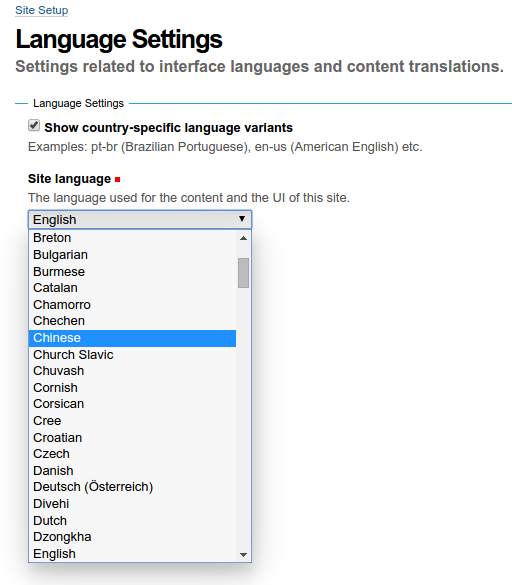
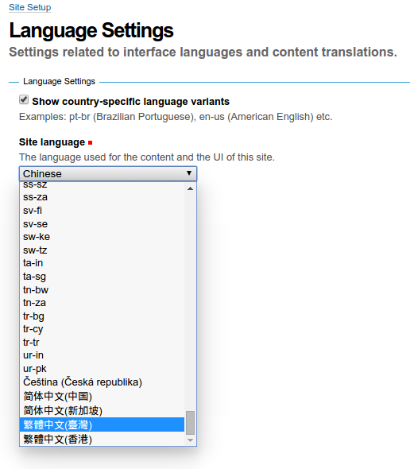
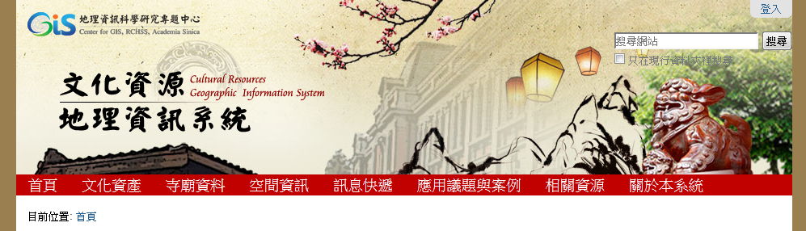

.. contents::

Introduction
============

crgis.theme offers theme resources for the CRGIS project based on Sunburst.

Installation
============

The easiest way is to use Plone 4.3.x UnifiedInstaller to get started.
Add this line in the eggs section of your ``buildout.cfg``::

    eggs =
        ...
        crgis.theme

Language Setting
================

